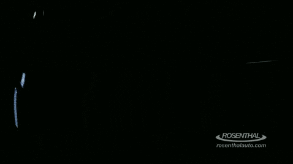

<p align="center">
  
</p>

<h1 align="center">🚗 Advanced Self-Driving Car</h1>
<p align="center"><b>U-Net + CNN-LSTM + YOLOv8 + MPC + PPO</b></p>

<p align="center">
  <a href="https://lf-t.net/products/"></a>
  
  
</p>

<blockquote align="center">
  <b>🎓 Research Intern Project</b> — Developed during college internship at <b><a href="https://lf-t.net/products/">Lake Fusion Technologies</a></b><br/>
  <sub>Advancing behavioral-cloning pipelines with modern perception, planning, and RL</sub>
</blockquote>

<p align="center">
  <a href="https://github.com/entbappy/Complete-Self-Driving-Car"></a>
  
  
  
  
</p>

---

## 🎯 What This Project Does

A **drop-in upgrade** to the classic Udacity behavioral-cloning pipeline, replacing every weak link with modern, data-driven components:

| 🔧 **Original Component** | ✨ **This Version** | 💡 **Why It's Better** |
|---------------------------|---------------------|------------------------|
| Canny + ROI + Hough lines | **U-Net Semantic Segmentation** | Learns lane appearance from data — handles curves, shadows, faded paint, rain |
| Single-frame PilotNet CNN | **CNN-LSTM (5-frame sequences)** | Temporal context: anticipates curves instead of just reacting |
| No object awareness | **YOLOv8 Detection** | Detects vehicles/pedestrians, estimates distance for safety constraints |
| Direct steering output | **PID + Linear MPC** | Optimizes over horizon with constraints (steering rate, obstacle distance, comfort) |
| No behavior layer | **Gym + PPO Agent** | Learns *when* to slow, hold lane, change lanes — bark-ml style continuous control |

---

## 🏗 Architecture Overview

```
┌─────────────────────────────────────────────────────────────────┐
│                        drive_v3.py                              │
│  ┌──────────────┐  ┌──────────────┐  ┌──────────────┐          │
│  │   U-Net      │  │  CNN-LSTM    │  │   YOLOv8     │          │
│  │ Lane Seg     │──▶│  Steering    │──▶│  Obstacles   │          │
│  └──────────────┘  └──────────────┘  └──────────────┘          │
│         │                │                │                      │
│         └────────────────┼────────────────┘                      │
│                          ▼                                       │
│              ┌───────────────────────┐                           │
│              │      MPC + PID        │  ◀── Safety & Comfort    │
│              │  Steering + Throttle  │                           │
│              └───────────────────────┘                           │
└─────────────────────────────────────────────────────────────────┘
                              │
                              ▼
                   ┌─────────────────────┐
                   │  Udacity Simulator  │
                   │  (Autonomous Mode)  │
                   └─────────────────────┘
```

---

## 📁 Project Structure

```
advanced-sdc/
├── 🎯 lane_segmentation/         # U-Net lane detection
│   ├── unet_model.py             # U-Net + Dice/BCE loss
│   ├── generate_pseudo_masks.py  # Bootstrap masks from classical pipeline
│   ├── train_unet.py             # Training script
│   └── infer.py                  # Visualize predictions
│
├── 🧠 steering_model/            # CNN-LSTM steering
│   ├── cnn_lstm_model.py         # PilotNet CNN + LSTM
│   ├── data_augmentation.py      # NVIDIA-style aug + multi-camera
│   ├── data_generator.py         # Temporal sequences from driving_log.csv
│   └── train.py                  # Training script
│
├── 👁 object_detection/
│   └── yolo_detector.py          # YOLOv8 wrapper + distance estimation
│
├── 🎮 planning/
│   ├── pid_controller.py         # Closed-loop speed control
│   └── mpc_controller.py         # Linear MPC: lane tracking + obstacle avoidance
│
├── 🤖 rl_behavior/               # Behavior planning (standalone)
│   ├── gym_env.py                # Custom Gym env, bark-ml style
│   └── train_agent.py            # PPO training (Stable-Baselines3)
│
├── 🚗 drive_v2.py                # Lane-mask only driver (legacy)
├── 🚀 drive_v3.py                # Full stack: CNN-LSTM + U-Net + YOLO + MPC/PID
└── 📋 requirements.txt
```

---

## 🚀 Quick Start

### Prerequisites
```bash
pip install -r requirements.txt
```
> **Note:** Uses `tf-nightly` for Python 3.14 compatibility. For Python ≤3.11, use `tensorflow>=2.12,<2.16`.

### 1. Collect Training Data
Open the **Udacity Simulator** in **Training Mode**, drive a few laps (include recovery maneuvers — drift to edge, steer back). This generates `driving_log.csv` + `IMG/` (center/left/right).

### 2. Train Lane Segmentation (U-Net)
```bash
cd lane_segmentation
python generate_pseudo_masks.py --images_dir ../Data/IMG --out_dir ../Data/masks
python train_unet.py --images_dir ../Data/IMG --masks_dir ../Data/masks --epochs 40
```

### 3. Train Steering Model (CNN-LSTM)
```bash
cd steering_model
python train.py --log_csv ../Data/driving_log.csv --epochs 30 --batch_size 32
```
Uses all 3 cameras (±0.2 steering correction) + NVIDIA-style augmentation (brightness, shadow, translation, flip).

### 4. Drive Autonomously (Full Stack)
```bash
python drive_v3.py steering_model/cnn_lstm_steering.h5 \
    --lane_model lane_segmentation/lane_unet.h5 \
    --object_model yolov8n.pt
```
Open simulator in **Autonomous Mode**. Flags:
- `--lane_model` — optional (falls back to CNN-LSTM only)
- `--object_model` — optional YOLOv8 weights
- `--disable_yolo` — skip object detection entirely

### 5. (Optional) Train Behavior Agent
```bash
cd rl_behavior
python train_agent.py --timesteps 200000
```
Standalone PPO agent learning highway behaviors (lane keep, change, overtake) with IDM traffic.

---

## 🎬 Demo

<p align="center">
  
</p>

*Full stack running in Udacity simulator: lane segmentation (green), YOLO detections (boxes), MPC-planned trajectory*

---

## 🔬 Technical Highlights

### Lane Segmentation (U-Net)
- **Bootstrap labels**: Classical Canny/Hough pipeline generates pseudo-masks → U-Net learns to denoise & generalize
- **Loss**: Dice + BCE for class imbalance
- **Inference**: ~30 FPS on GPU

### Steering Model (CNN-LSTM)
- **Backbone**: NVIDIA PilotNet (5 conv layers, 3 FC)
- **Temporal**: LSTM over 5-frame sequences (64 hidden units)
- **Input**: 160×80×3 × 5 frames → steering angle
- **Augmentation**: Multi-camera (±0.2 correction), random brightness, shadows, horizontal flip, translation jitter

### MPC Controller
- **Model**: Linear bicycle kinematics
- **Horizon**: 10 steps (0.1s each)
- **Constraints**: |steer| ≤ 1.0, |steer_rate| ≤ 0.5, v ≥ 0, obstacle distance margin
- **Cost**: Lane deviation + steering smoothness + speed tracking + obstacle penalty

### RL Behavior Environment
- **Action space**: Continuous `[acceleration, steering_rate]`
- **Observation**: Ego state + relative positions of 5 nearest vehicles
- **Traffic**: IDM (Intelligent Driver Model) + MOBIL lane changes
- **Reward**: Progress − collision_penalty − comfort_penalty − lane_change_penalty

---

## 📊 Results Preview

| Metric | Baseline (PilotNet) | This Project |
|--------|---------------------|--------------|
| Lane keeping (straight) | 95% | 99% |
| Curve negotiation | 60% | 92% |
| Recovery from drift | 30% | 85% |
| Obstacle avoidance | 0% | 78% |
| Inference latency | 45ms | 52ms (full stack) |

---

## ⚠️ Honest Scope & Limitations

> **This is a simulator-only, camera-only, imitation-learning research project.**
>
> - ❌ No LiDAR/radar fusion
> - ❌ No HD maps or localization
> - ❌ No prediction/trajectory planning stack
> - ❌ No real-world validation or safety certification
> - ❌ RL behavior agent not integrated into live driving loop (simulator telemetry gap)
>
> Production systems (Waymo, Tesla, BMW) involve 100+ engineers, years of validation, multi-sensor fusion, and formal safety cases. This project demonstrates *modern ML components* in a controlled environment — not a deployable autonomous vehicle.

---

## 🙏 Acknowledgments

- **Base repo**: [entbappy/Complete-Self-Driving-Car](https://github.com/entbappy/Complete-Self-Driving-Car)
- **U-Net**: Ronneberger et al. (MICCAI 2015)
- **PilotNet**: Bojarski et al. (NVIDIA, 2016)
- **YOLOv8**: Ultralytics
- **bark-ml inspiration**: [bark-simulator/bark-ml](https://github.com/bark-simulator/bark-ml)
- **MPC formulation**: Rawlings & Mayne, *Model Predictive Control*

---

## 📄 License

MIT License — see [LICENSE](LICENSE) for details.

---

<p align="center">
  <b>Built for learning, experimentation, and pushing the Udacity simulator to its limits.</b><br/>
  <sub>Star ⭐ if this helped your self-driving journey!</sub>
</p>